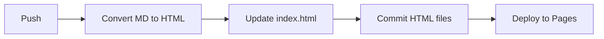

# CTF Writeups - GitHub Pages Publisher


> **Obsidian** yazılarınızı otomatik olarak **GitHub Pages**'te yayınlayın. CTF writeup'ları, blog yazıları, notlarınızı tek push ile yayınlayın.

## Özellikler

- **Otomatik Markdown → HTML** - Push yapın, HTML otomatik oluşturulsun
- **Dinamik index.html** - Yeni writeup'lar otomatik listelenir
- **Obsidian resim link desteği** - `![[resim.png]]` formatı çalışır
- **GitHub Actions entegrasyonu** - Tam otomatik deploy
- **GitHub Pages hosting** - Ücretsiz statik site

## Kullanım Alanları

- **CTF Writeup'ları** - TryHackMe, HackTheBox çözümlerinizi dokümante edin
- **Blog Yazarlığı** - Obsidian'da yazın, GitHub Pages'te yayınlayın
- **Teknik Notlar** - Geliştirme notlarınızı paylaşın
- **Akademik Yazılar** - Araştırma notlarınızı yayınlayın

## Teknolojiler

| Teknoloji | Kullanım Amacı |
|-----------|----------------|
| **Python 3.11+** | Markdown → HTML script |
| **markdown2** | Markdown parsing |
| **GitHub Actions** | CI/CD otomasyonu |
| **GitHub Pages** | Statik site hosting |
| **Obsidian** | Markdown editörü |

## Kurulum

### 1. Depoyu Klonlayın

```bash
git clone https://github.com/onurcangnc/ctf_writeups.git
cd ctf_writeups
```

### 2. GitHub Pages'i Aktifleştirin

1. Repo → Settings → Pages
2. Source: **GitHub Actions**

## Kullanım

### Yazı Yazın

Obsidian'da `TryHackMe/ChallengeName/writeup.md` oluşturun:

```markdown
# CTF Challenge Name

Walkthrough content...

![[images/screenshot.png]]
```

Resimleri `TryHackMe/ChallengeName/images/` klasörüne koyun.

### Yayınlayın

```bash
git add .
git commit -m "Add new CTF writeup"
git push
```

**Bu kadar!** GitHub Actions otomatik olarak:
1. ✅ Markdown'ı HTML'e çevirir
2. ✅ index.html'i günceller
3. ✅ GitHub Pages'e deploy eder

## Proje Yapısı

```
ctf_writeups/
├── .github/
│   └── workflows/
│       └── deploy.yml                    # Auto deploy workflow
├── TryHackMe/
│   ├── ChallengeName/
│   │   ├── writeup.md                    # Obsidian'da yazın
│   │   └── images/                       # Resimler
│   └── ...
├── convert_md_to_html.py                 # MD → HTML script
└── index.html                            # Ana sayfa (auto)
```

## Obsidian Resim Linkleri

Script Obsidian formatını otomatik dönüştürür:

| Obsidian | HTML |
|----------|------|
| `![[images/1.png]]` | `` |

## Workflow

Her `push`'ta:



## Live Demo

👉 https://onurcangnc.github.io/ctf_writeups/

## Contributing

1. Fork yapın
2. Feature branch oluşturun (`git checkout -b feature/amazing-feature`)
3. Commit edin (`git commit -m 'Add amazing feature'`)
4. Push yapın (`git push origin feature/amazing-feature`)
5. Pull Request açın

## License

MIT License - kendi projenizde özgürce kullanın.

---

**Not:** Bu proje originally CTF writeup'ları için geliştirilmiştir ancak **herhangi bir Obsidian → GitHub Pages otomasyonu** için kullanılabilir.
